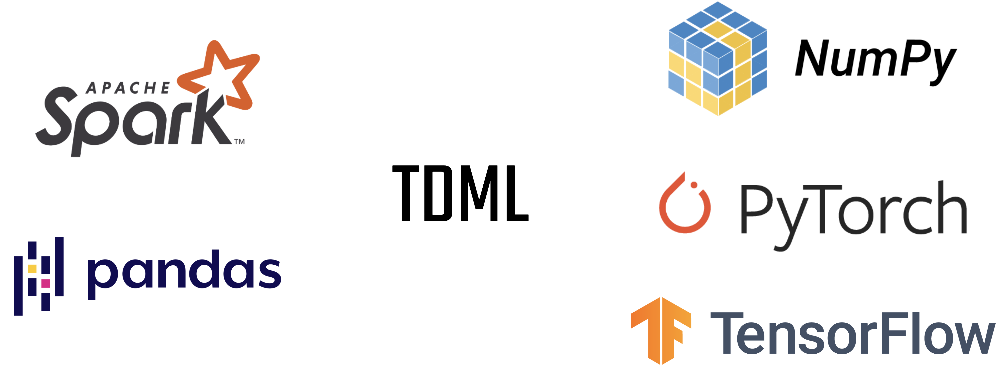

:github_url: https://github.com/zechengz/tdml

TDML Documentation
==================

A lightweight and easy-to-use Python package that transforming dataframes 
into machine learning friendly data format.

Transform Dataframe for Machine Learning
----------------------------------------

Current dataframes, including Pandas and PySpark, are widely used to manipulate tabular data. These packages provide rich functionalities and optimizations for data processing. But after the processing, data is usually input to machine learning or deep learning models, which are constructed by other ML packages. In this step, the user needs to spend time in transforming dataframes into arrays or tensors, splitting data into several sets, mapping categorical data to integers, and even representing text data by vectors. To make the whole process more efficient, TDML bridges the dataframes and ML frameworks by addressing the aforementioned painful issues. Currently, TDML provides functions including:

* Automatically transform dataframe (Pandas or PySpark) into ML framework (NumPy, PyTorch or TensorFlow) arrays or tensors.
* Map categorical data to integers, represent text data by bag-of-word and support UDF on text transformation.
* Split transformed data into several sets (train-test or train-validation-test) by one line of code.
* Support reshuffling the train set after the splitting.

.. toctree::
   :glob:
   :maxdepth: 1
   :caption: Overview

   notes/installation
   notes/background
   notes/introduction
   notes/examples

.. toctree::
   :glob:
   :maxdepth: 1
   :caption: Package Reference

   modules/dataset
   modules/framework
   modules/dataframe
   modules/data

Indices and Tables
==================

* :ref:`genindex`
* :ref:`modindex`